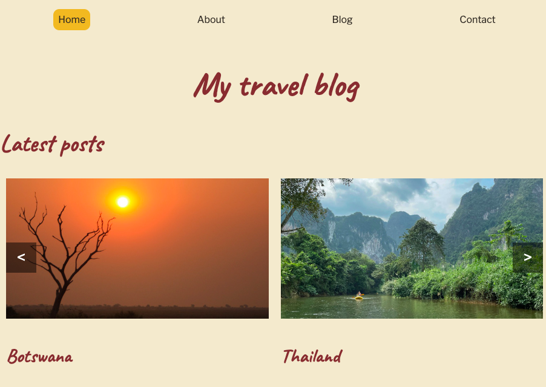

# Project Exam 1 – My Travel Blog



My Travel blog contains blog posts about journeys around the world.

## Description

This project is an exam delivery for first year Front End Development students at Noroff, covering design, HTML and CSS, JavaScript, interaction design and content management systems.

Images on the page are my own from various travels, while all text is written by ChatGPT by OpenAI.

The website is responsive across devices and it is fetching products from a WordPress REST API.

### Requrements for the exam

- Home page with carousel
- About page
- List of blog posts, showing 10 posts at the time, and a button to load 10 more.
- Blog post specific pages with clickable images
- Contact page with validation requirements

## Built with

- HTML
- CSS
- JavaScript
- WordPress

## Getting started

### Installing

It is easy for you to get this project started:

1. Clone the repository:

```bash
git clone git@github.com:Noroff-FEU-Assignments/project-exam-1-VReinhaug
```

2. Install the dependencies:

```
npm install
```

### Running

To run the app, run the following command:

```
npm run start
```

## Contact

For any feedback or questions, please contact me [on LinkedIn](https://www.linkedin.com/in/veronika-reinhaug/).
